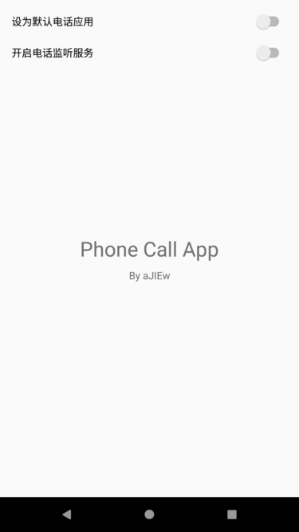
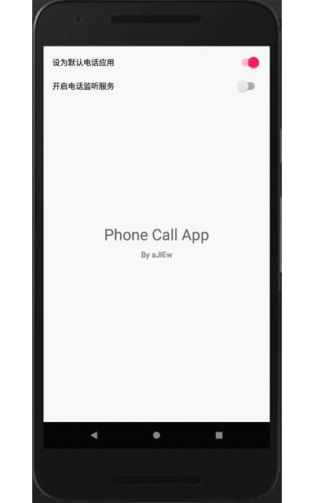
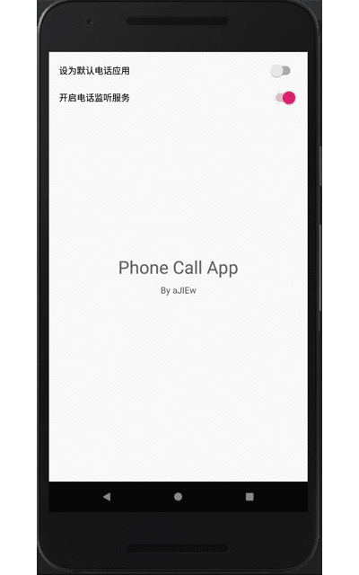

## Phone Call App

This project shows you how to make your app as the default phone call app and manage phone calls (only for 6.0+), it also shows you how to listen phone call states.

本项目主要演示了如何将你的应用设置为默认电话应用并对电话接打进行管理，同时也演示了如何监听电话状态。

### Demo

主页面：

设置为默认电话应用（Android 6.0+）：

监听来电：

原文链接：[安卓代替系统默认电话应用 (Android 6.0+) 与电话状态监听](https://ajiew.github.io/2018-08-11-android-replace-default-phone-app-and-listen-phone-calls/)
